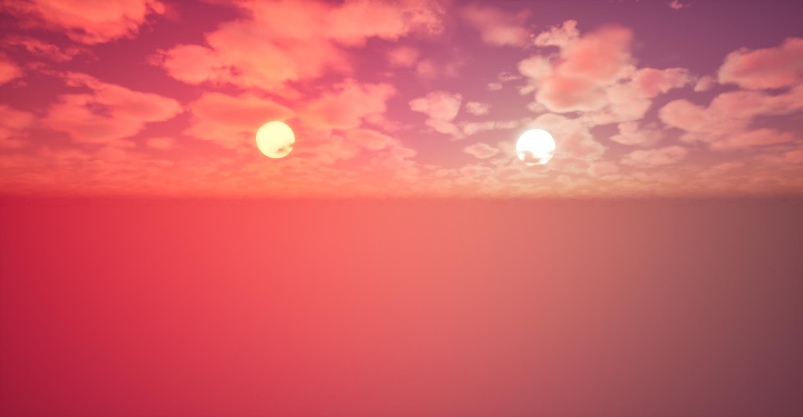
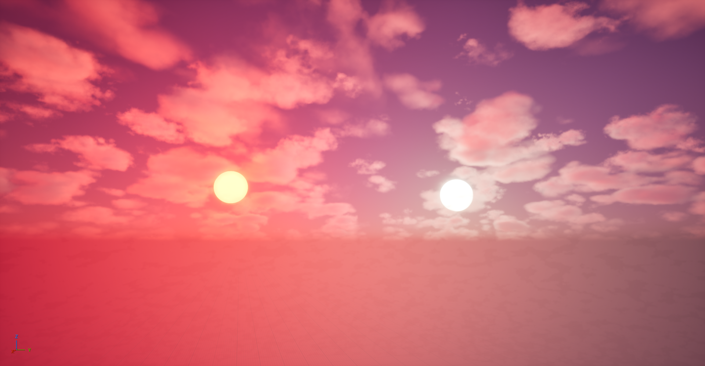
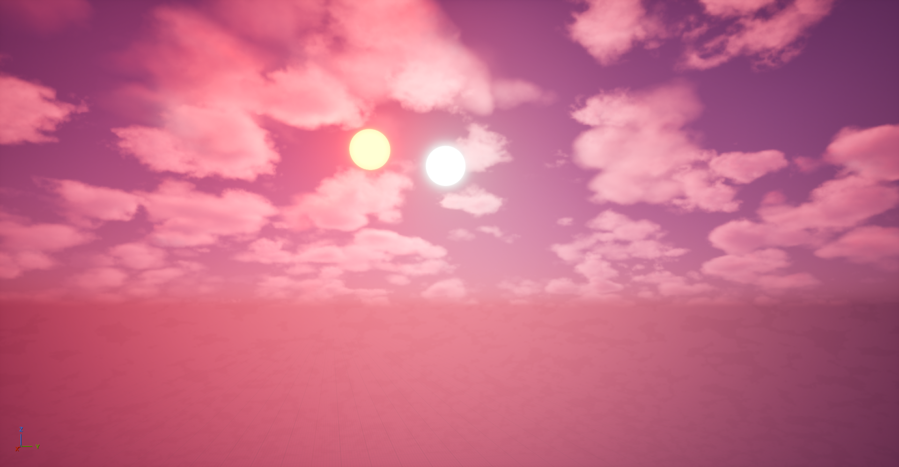
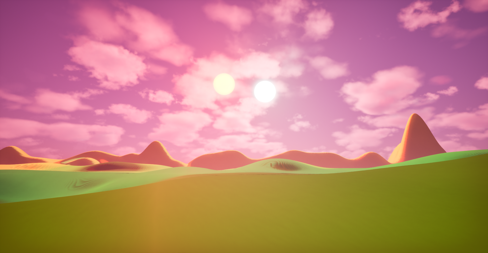

# UE5 Landscape Practice

This is a practice project for learning landscape creation and open-world environment design in Unreal Engine 5.  
It covers topics such as:  
- Lighting and atmosphere  
- Landscape sculpting and materials  
- Texture tiling  
- Foliage painting  
- Post-processing  
- Environment polishing 
- Background creation
- Level instances

## About
This project is part of my journey to improve in Unreal Engine 5 and in my game development skills.  

## Screenshots
### Atmosphere Screenshots

  
Click to view Dual Sun screenshots

  

    
    
    
  

### Painted Landscape

  
Click to view Painted Landscape screenshots

  

    
  

