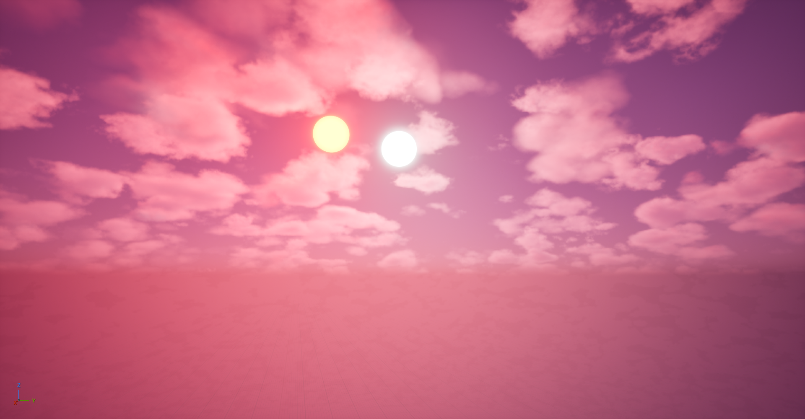
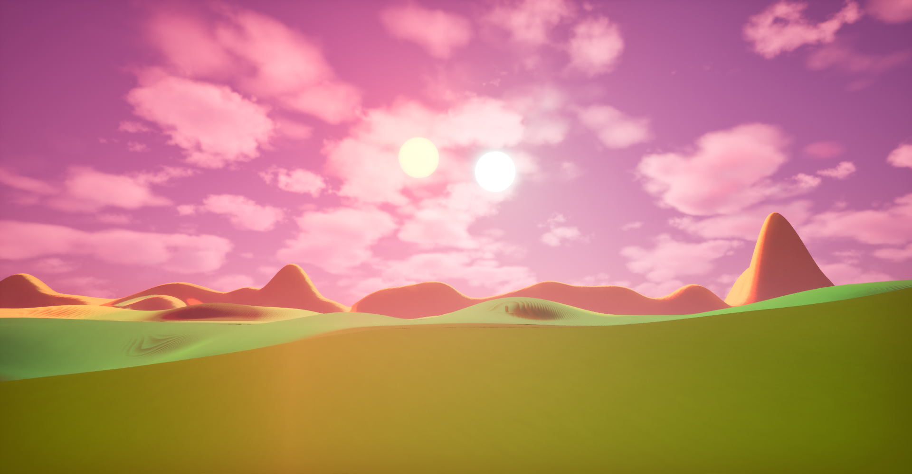
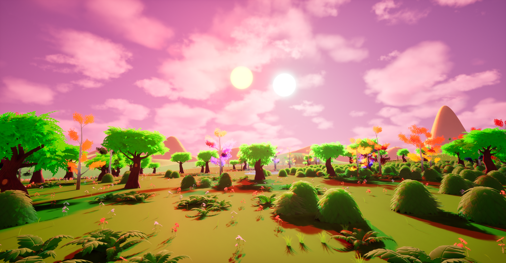
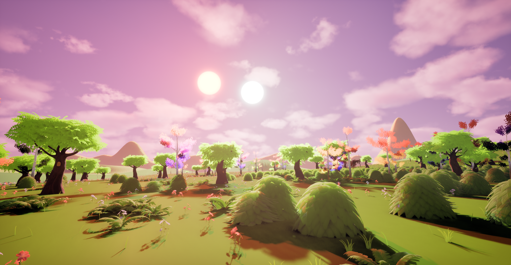
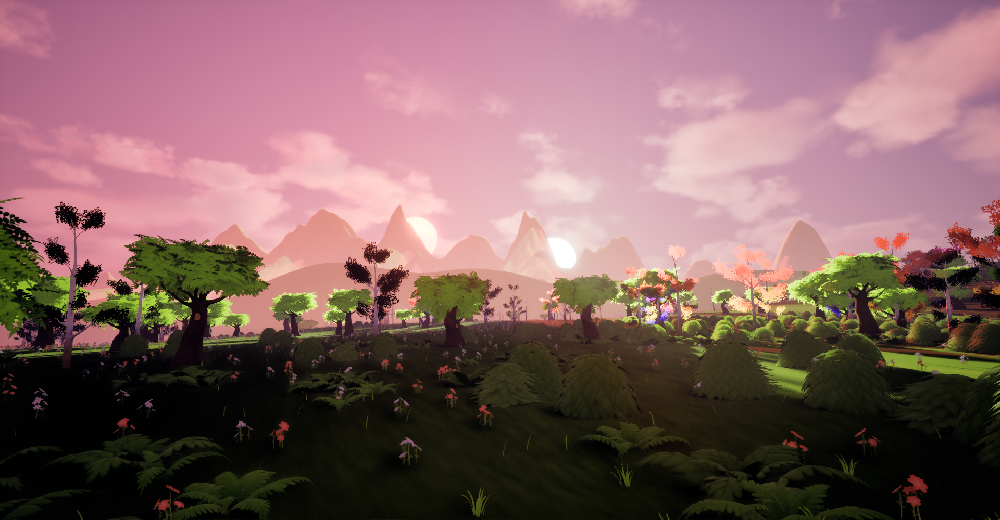
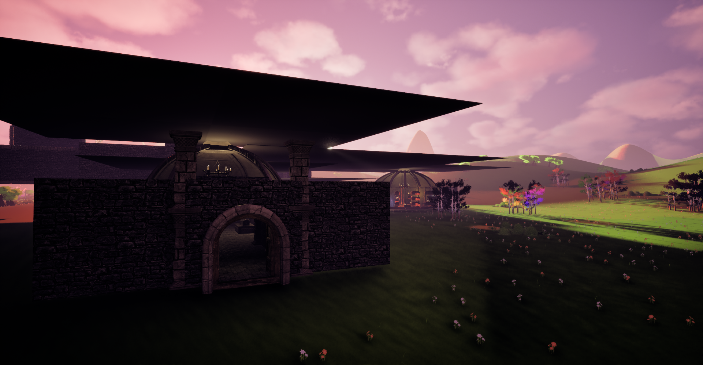

# UE5 Landscape Practice

This is a practice project for learning landscape creation and open-world environment design in Unreal Engine 5.  
It covers topics such as:  
- Lighting and atmosphere  
- Landscape sculpting and materials  
- Texture tiling  
- Foliage painting  
- Post-processing  
- Environment polishing 
- Background creation
- Level instances

## About
This project is part of my journey to improve my skills in Unreal Engine 5 and game development.

## Project Progress Screenshots
### 1. Atmosphere with two suns

  
Click to view Atmosphere screenshot

  

    
  

### 2. Painted Landscape

  
Click to view Painted Landscape screenshot

  

    
  

### 3. Foliage Painting

  
Click to view Landscape with Foliage screenshot

  

    
  

### 4. Landscape with Post Process Volume

  
Click to view Post Process Volume screenshot

  

    
  

### 5. Mountains new shapes and Foliage polshing ups

  
Click to view Mountains new shapes and Foliage polishing ups screenshot

  

    
  

### 6. Dungeon Level Instance

  
Click to view Dungeon Level Instance screenshot

  

    
  

